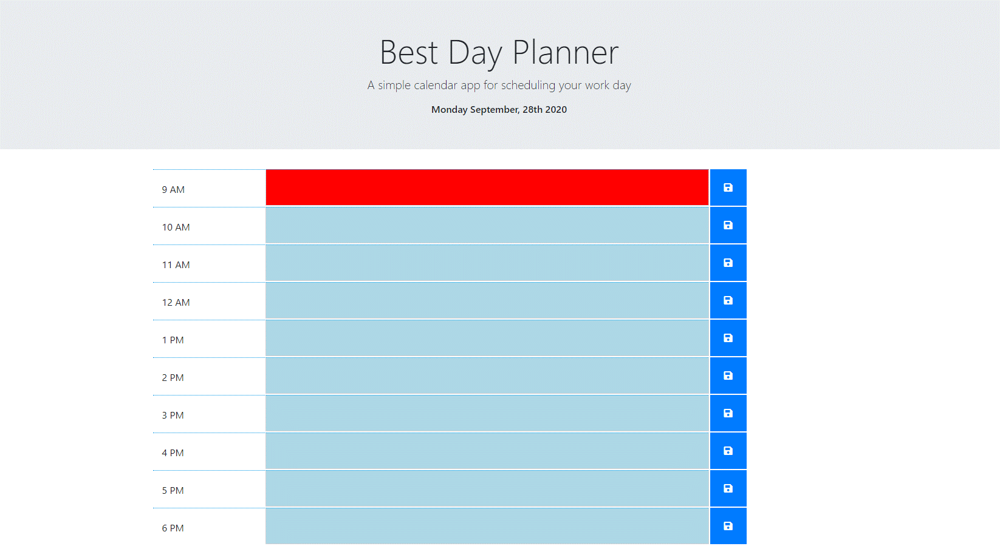
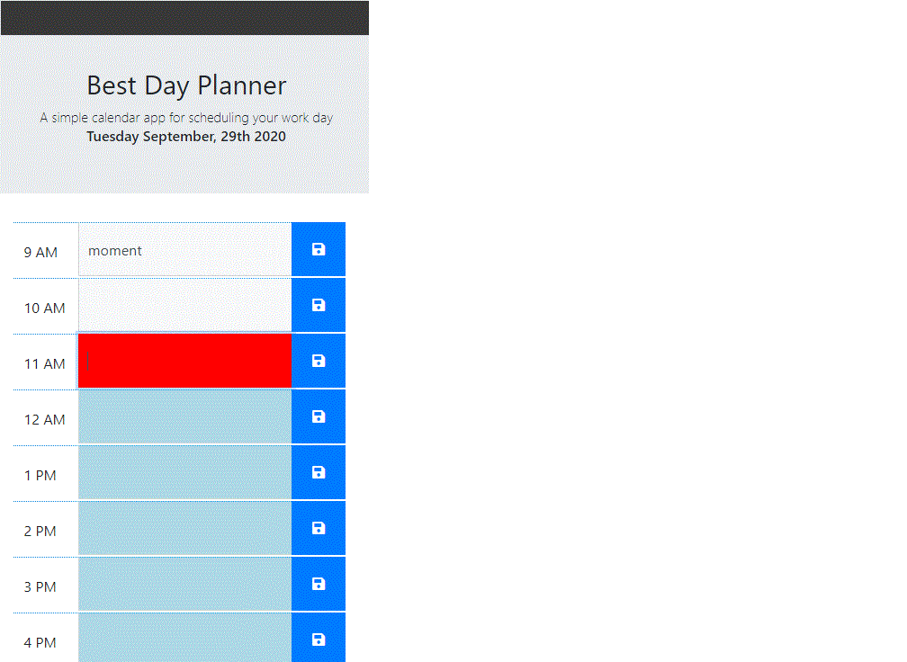

# Best Day Planner

An employee with a busy schedule can add important events to a daily 
planner so that they can manage their time effectively.

## Description:

```

A simple calendar application that allows the user to save events for each hour of the day. This app will run
 in the browser and feature dynamically updated HTML and CSS powered by jQuery and feature Moment.js. 

```

## Technologies:

```
- HTML5
- CSS3
- Bootstap 4
- Responsive Design(RWD)
- Moment.js
- Jquery

```
## Staging Link:
https://bbarello.github.io/best_day_planner/


## Screenshot:





